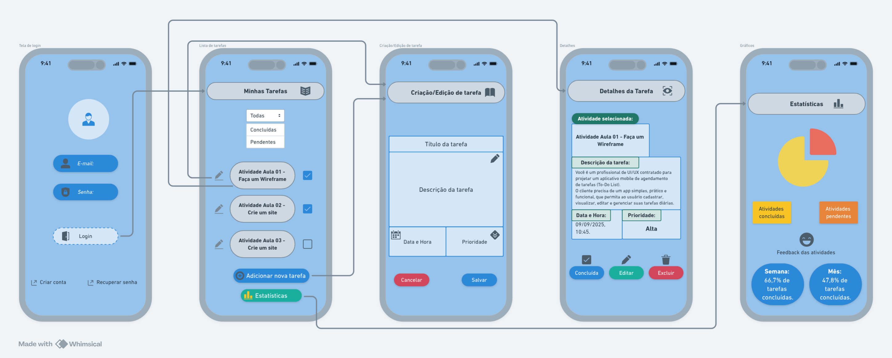

# Projeto de Protótipo Visual de Aplicativo To-Do List

    Este é um projeto acadêmico puramente visual, desenvolvido em sala de aula, com o objetivo de refinar um wireframe e transformá-lo em um protótipo de alta fidelidade. 
    O foco principal é a experiência do usuário (UX) e a interface do usuário (UI), demonstrando a aparência e a navegação de um aplicativo de lista de tarefas (To-Do List).

*Importante:* Este protótipo não possui funcionalidades de back-end. As interações são limitadas à navegação entre as telas estáticas através dos links e botões.

**Wireframe Original:**

*Como Utilizar o Protótipo*
    Para explorar o protótipo, siga os passos abaixo. A navegação simula o uso de um aplicativo mobile.

*Tela de Login (login.html):*

    Abra o arquivo login.html em qualquer navegador de internet.

    Esta é a tela inicial que apresenta os campos para e-mail e senha, além das opções para criar uma conta ou recuperar a senha.

    Clique no botão "Login" para ser direcionado à tela principal de tarefas.

*Tela de Tarefas (tarefas.html):*

    Nesta tela, você pode visualizar uma lista de tarefas. Algumas aparecem como concluídas (marcadas) e outras como pendentes.

    Para ver os detalhes de uma atividade específica, clique no texto da tarefa (ex: "Atividade Aula 01 - Faça um Wireframe").

    Para simular a edição, clique no ícone de lápis ao lado da tarefa.

    Na parte inferior, utilize o botão "+ Adicionar nova tarefa" para ir à tela de criação ou clique em "Estatísticas" para visualizar a tela de progresso.

*Tela de Detalhes da Tarefa (detalhes_tarefa.html):*

    Aqui são exibidas todas as informações de uma tarefa, como a descrição completa, data, hora e prioridade.

    Os botões na parte inferior permitem simular as ações de marcar como "Concluída", "Editar" a tarefa ou "Excluir".

    Clique em "← Voltar para Tarefas" para retornar à lista principal.

*Tela de Criação/Edição de Tarefa (editar_tarefa.html):*

    Esta tela permite adicionar um título, uma descrição, definir data, hora e a prioridade da tarefa.

    Ao clicar em "Salvar" ou "Cancelar", você será redirecionado de volta para a tela principal de tarefas.

*Tela de Estatísticas (estatisticas.html):*

    Apresenta um resumo visual do progresso, com gráficos sobre as atividades concluídas e pendentes.

    Para retornar, utilize o link "← Voltar para Tarefas" na parte inferior da tela.
